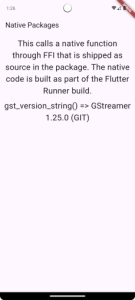
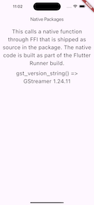

# Flutter + GStreamer Example

This repository demonstrates how to integrate GStreamer with Flutter using FFI (Foreign Function Interface) and package [ffigen](https://pub.dev/packages/ffigen). It serves as a foundational example for projects aiming to leverage GStreamer’s capabilities in cross-platform Flutter applications.

---

## What is this project?

The project showcases the integration of GStreamer into a Flutter application by utilizing the FFI for communication with native libraries. Currently, it focuses on the **Android** platform, with **iOS** support under development.

The only functionality implemented so far is retrieving the GStreamer version using the native function `gst_version_string`.

---

## [Android] How to Set Up the Project

### 1. Build GStreamer
Before running the project, you need to compile GStreamer for Android using Cerbero. Follow the official GStreamer documentation for detailed instructions:
[Building from source using Cerbero](https://gstreamer.freedesktop.org/documentation/installing/building-from-source-using-cerbero.html?gi-language=c#cross-compilation)

### 2. Configure the GStreamer Path

Set the environment variable GSTREAMER_ROOT_ANDROID to the path where GStreamer was built on your machine. For example:

```bash
export GSTREAMER_ROOT_ANDROID="/your/path/to/gstreamer/build/dist/android_universal"
```

Replace "/your/path/to/gstreamer/build/dist/android_universal with the actual path to your GStreamer build directory. Ensure this environment variable is available in your terminal or IDE before building the project.

### 3. Run the Example Project
After configuring GStreamer, you can run the example located in the `example/` directory. Use the standard Flutter commands:

```bash
cd example/
flutter run
```

Ensure you have an Android device or emulator set up.

---

## [iOS] How to Set Up the Project

### 1. Install GStreamer binaries
Follow the GStreamer Tutorial [Download and install GStreamer binaries](https://gstreamer.freedesktop.org/documentation/installing/for-ios-development.html?gi-language=c#download-and-install-gstreamer-binaries)

### 2. Run the Example Project
After configuring GStreamer, you can run the example located in the `example/` directory. Use the standard Flutter commands:

```bash
cd example/
flutter run
```

Ensure you have an iPhone device or simulator set up.

---

## What is Done?

1. **Platforms:**
   - Full support for **Android**.
   - Full support for **iOS**.

2. **Functionality:**
   - Retrieves the GStreamer version using the native `gst_version_string` function.
   
   
   


---

## Next Steps

- Complete iOS support.
- Add more functionality, such as:
  - Initializing GStreamer pipelines.
  - Playing audio files.
  - Stream manipulation.

---

If you encounter issues or have suggestions, feel free to open an issue or submit a pull request! 🚀

